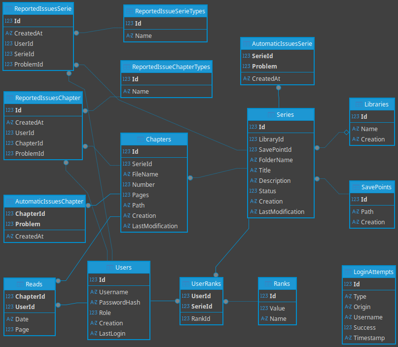
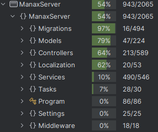

# Manax
## Gestionnaire de Manga/Comics/BD Open Source

*Une solution complète pour l'organisation et la gestion de votre collection*

**Présentation Technique**

---

## Sommaire

- Introduction
- Fonctionnalités
- Architecture Serveur
- Architecture Client
- Points intéressants (notifications)
- Points intéressants (corrections automatiques)
- Déploiement et Configuration
- Tests et robustesse
- Améliorations futures

---

## Introduction

### Qu'est-ce que Manax ?

<div class="columns">
<div>

**🎯 Vision du projet**
- Gestionnaire de collection de manga/comics/BD
- Solution open source complète
- Interface moderne et intuitive

**📈 Philosophie**
- Séparation organisation/stockage
- Performance et robustesse
- Expérience utilisateur optimale

</div>
<div>

**🏗️ Stack technique**
- **.NET 8.0** (Serveur + Client)
- **ASP.NET Core** (API REST)
- **Avalonia UI** (Interface desktop)
- **Entity Framework** (ORM)
- **SQLite** (Base de données)

</div>
</div>

---

## Fonctionnalités

### Gestion de collection

<div class="columns">
<div>

**📚 Organisation**
- Bibliothèques virtuelles
- Points de sauvegarde flexibles
- Séries et chapitres

**👥 Multi-utilisateurs**
- Système de rôles (User/Admin/Owner)
- Authentification JWT sécurisée
- Suivi personnalisé par utilisateur

</div>
<div>

**🔍 Fonctions avancées**
- Détection d'anomalies automatique
- Système de notifications temps réel
- Statistiques détaillées

**📱 Interface**
- Design moderne
- Mises à jour temps réel
- Thèmes multiples

</div>
</div>

---

## Architecture Serveur

### ASP.NET Core 8

<div class="columns">
<div>

**Structure du projet**
```csharp
ManaxServer/
├── Controllers/     // API REST
├── Models/         // Entités métier
├── Services/       // Logique applicative
├── Migrations/     // Base de données
└── Tasks/          // Tâches asynchrones
```

</div>
<div>


**Migrations automatiques**
- Modèles → Migrations
- Migrations → Serveur
- Mise à jour automatique du schéma

---

## Architecture Serveur - Base de données SQLite

<div class="center-image">



</div>

---

## Architecture Client

### Avalonia UI avec MVVM

<div class="columns">
<div>

**Structure MVVM**
```csharp
ManaxClient/
├── Models/         // Entités client
├── Views/          // Interfaces AXAML
├── ViewModels/     // Logique présentation
└── Controls/       // Composants réutilisables
```

**Pattern Observable**
```csharp
public partial class MyPageViewModel : PageViewModel
{   
    [ObservableProperty] 
    private bool _showAutomaticIssues = true;
}
```

</div>
<div>

**Avantages d'Avalonia**
- **Cross-platform** (Windows, Linux, macOS)
- **Performance native**
- **Architecture MVVM**

</div>
</div>

---

## Architecture Client

### Communication avec l'API

<div class="columns">
<div>

**Classes APICaller**
- Font les appels à l'API
- Fonctionnement asynchrone
- Retournent une valeur optionnelle

</div>
<div>

**Gestion des erreurs**
```csharp
// Modèle Optional pour la sécurité
Optional<bool> request = await Caller.ExecuteAsync();

if (request.Failed)
{
    ShowInfo(request.Error);
    return;
}
var result = request.GetValue();
// Continuer le traitement
```

</div>
</div>

---

## Points intéressants (notifications)

### Système de notifications temps réel

<div class="columns">
<div>

**Workflow de validation**

1. **Client** demande un changement
2. **Serveur** valide ou rejette la demande
3. **Si validé** → notification broadcast
4. **Tous les clients** mettent à jour

</div>
<div>

**✅ Avantages**
- Pas de fausses validations
- Pas besoin de recharger les pages
- Cohérence des données garantie

**⚠️ Inconvénients**
- Peut introduire un délai réseau
- Complexité supplémentaire

</div>
</div>

---

## Points intéressants (corrections automatiques)

<div class="columns">
<div>

**✅ Corrigés automatiquement**
- Mauvais format d'image
- Mauvais format d'archive
- Images trop grandes

**⚠️ Administrateur notifié**
- Images trop petites
- Absence de poster
- Description manquante
- Chapitre manquant
- Fichier illisible

</div>
<div>

**✅ Avantages**
- Moins de travail pour les administrateurs
- Qualité constante sur le serveur

**⚠️ Inconvénients**
- Peut prendre du temps sur machine faible
- Consommation CPU

**Processus intelligent**
- Execution en arrière-plan

</div>
</div>

---

## Déploiement et Configuration

### Options de déploiement multiples

<div class="columns">
<div>

**💻 Exécutable standalone**
- **Linux**
- **Windows**
- Installation simple
- Pas de dépendances

**🐳 Docker**
- Parfait pour **NAS** (Synology, QNAP)
- **Serveur dédié**
- **Homelab**

</div>
<div>

**⚙️ Configuration Docker**
```yaml
services:
  manaxapi:
    image: manaxapi
    ports:
      - "5246:5246"
    environment:
      - ASPNETCORE_ENVIRONMENT=Production
    volumes:
      - /path/to/collection:/media/save-point
```

**🔧 Configuration système**
- Service systemd (Linux)

</div>
</div>

---

## Tests et robustesse

### Suite de tests complète

<div class="columns">
<div>

**📊 Statistiques**
- **+150 tests** unitaires
- **54% de couverture** serveur
- **0 tests** pour le client (à améliorer)

</div>
<div>



</div>
</div>

---

## Améliorations futures

### Roadmap technique

<div class="columns">
<div>

**📅 Court terme**
- 📱 **Extension pour Mihon**
- 🚀 **Optimisation mémoire**
- 🔍 **Recherche avancée**
- 👤 **Gestion Auteur/Artiste**

</div>
<div>

**📅 Moyen terme**
- 🌍 **Internationalisation complète**
- 💾 **Sauvegardes automatiques**
- 🔄 **Migration Komga/Kavita**
- 👥 **Communauté d'utilisateurs**

</div>
</div>

---

## Conclusion


<div class="columns">

**Première utilisation de ASP.NET**
**Expériences avec des outils similaires**

</div>

---

## Merci pour votre attention !

### 🤔 Avez-vous des questions ?

**Discussion ouverte**
- Questions techniques
- Suggestions d'améliorations
